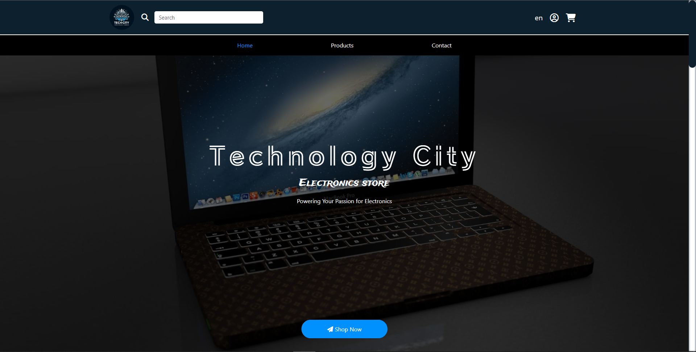

# Technology City

 

## Description: 

Technology City's website features easy navigation with a header navbar, welcoming visitors to explore its offerings on the landing page. Visitors can learn about the store's history, mission, and team, while also discovering key milestones in its timeline. Detailed descriptions of products and services are available, with a convenient contact section for inquiries. The footer provides quick access to legal information and social media links. 

## Contributors: 

[Mahmoud Elbehery (GitHub)](https://github.com/mahmoudramy84) | [Mahmoud Elbehery (LinkedIn)](https://www.linkedin.com/in/mahmoud-ramy-elbehery-752aab235)
 
[Safeya Yasien (GitHub)](https://github.com/Safeya-Yasien) | [Safeya Yasien (LinkedIn)](https://www.linkedin.com/in/safeya-yasien-2ba9b4260/)
 

## Live Demo: 

https://safeya-yasien.github.io/Tech-City_V-0.1/ 

## Website: 

http://tech-city.tech/ 
